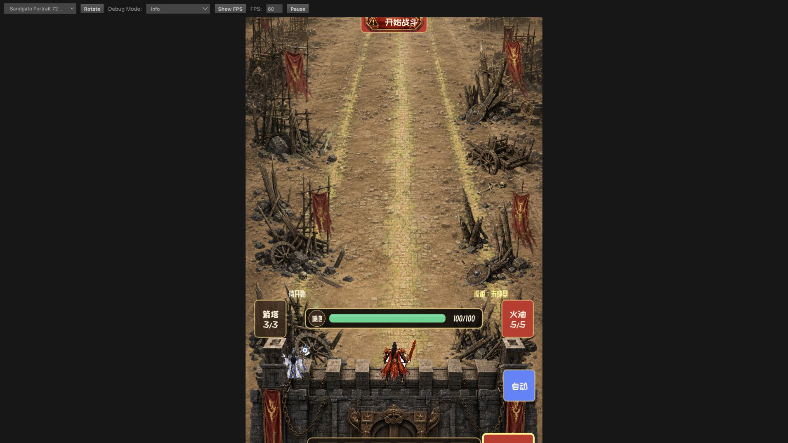
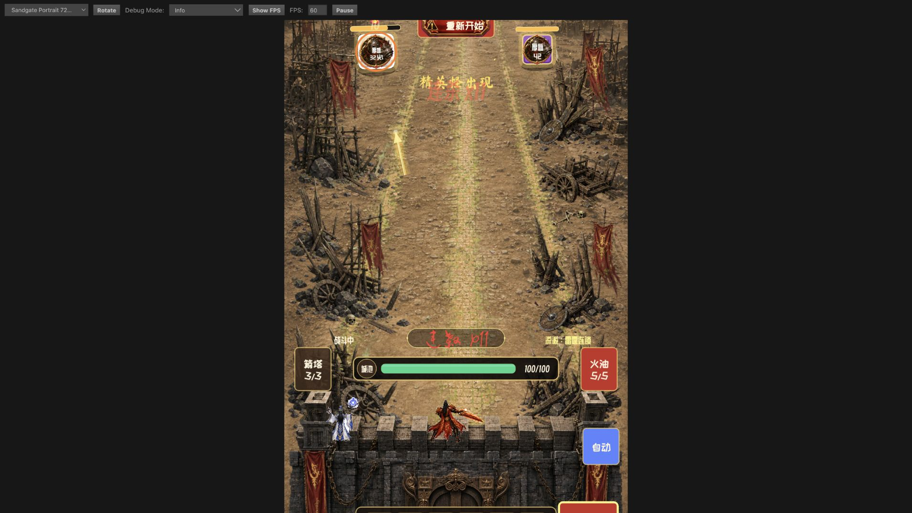
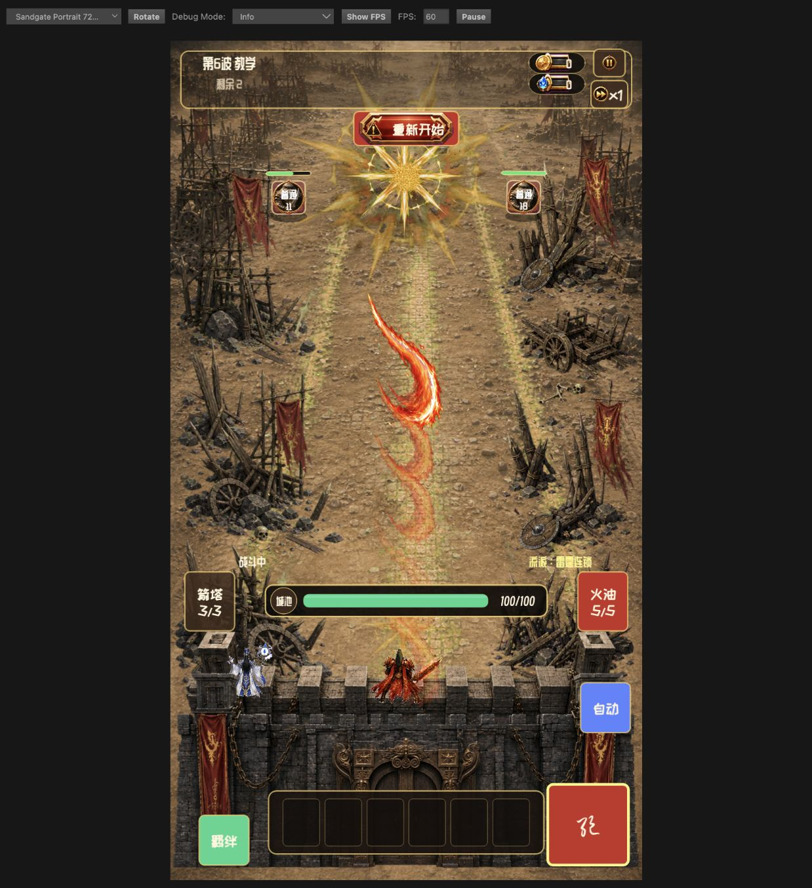
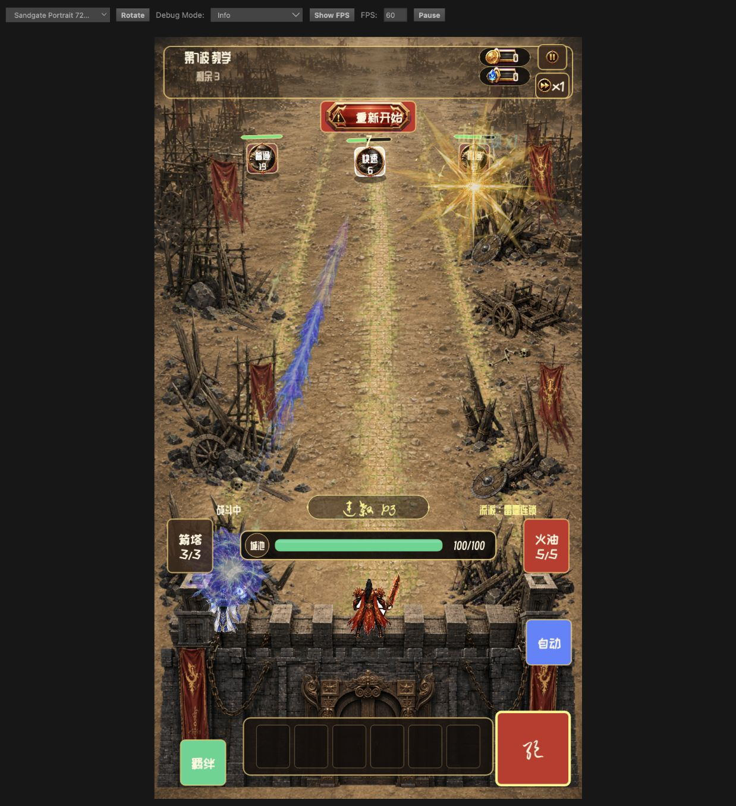
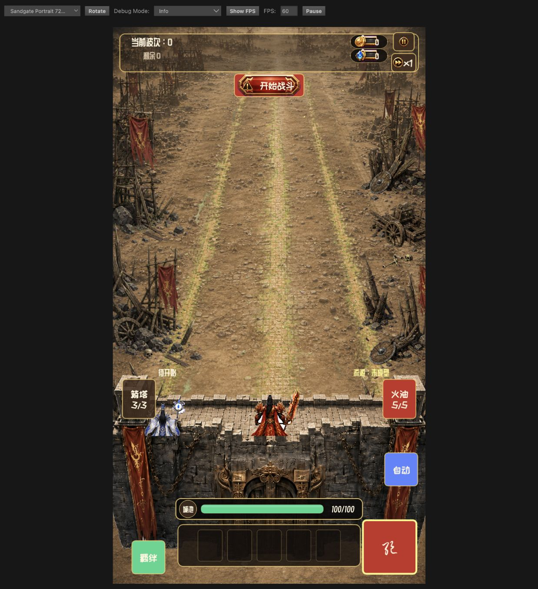
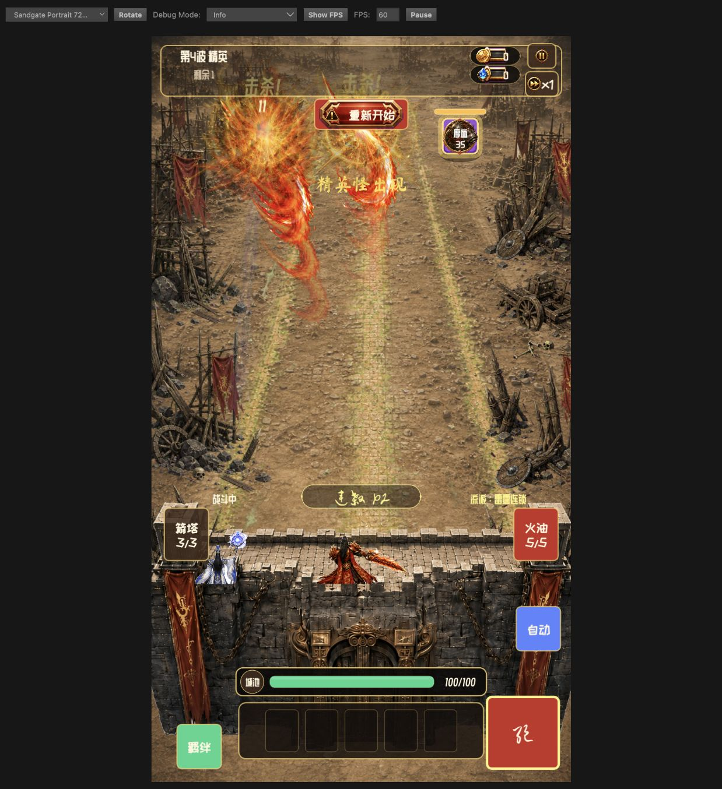

# 写实地形与战斗特效验收记录

日期：2026-07-12

## 验收环境

- Cocos Creator：3.8.8
- Web 预览：`http://localhost:7456/`
- 设计分辨率：720x1280，Portrait
- AI 资源模型：`gpt-image-2`
- 外部素材：未使用；地形、11 张 `fx_v2_*` 和 4 张 `fx_v3_hit_*` 特效纹理均在项目内生成或从用户参考图提取，并完成透明通道处理

## 自动验证

以下命令作为完整回归矩阵执行，全部要求退出码为 0：

```bash
npm run test:mvp
npm run test:spine-import
npm run test:thunder-mage-import
npm run test:terrain
npm run test:ui-layout
npm run test:hud-polish
npm run test:scene
npm run test:animation
npm run test:vfx
npm run typecheck
git diff --check
```

覆盖内容包括：地形尺寸与 Alpha、Cocos UUID 清单、五人站位、不可见逻辑防线、无脚下圆环、攻击事件元数据、全部英雄职业映射、对象池预算、特效资源和 Spine 攻速同步。

另使用 Cocos Creator 3.8.8 CLI 生成 Web Mobile 正式构建到 `/tmp/ai-game-web-release-gate/web-mobile`。构建日志完成 `Build Assets` 和 `build Task (web-mobile) Finished`；产物包含独立的 `assets/battle_common`、`assets/ui` 配置与 native 资源。

## 浏览器验收

- 首屏与空场：写实道路、外移后的左右废墟、后景气氛和参考图原始像素提取的完整前后城墙正常加载。
- 角色布局：五个站位共享 `y=-270` 基线并统一放大 30%；固定雷法师与主角主体完整露出，脚部由前墙自然遮挡，人物脚下无常驻圆圈。
- HUD：城墙血条位于五格矩形英雄头像栏上方，五槽无第六槽、无职业或“空位”说明文字，且不与角色重叠。
- 防线：没有可见红线或红色半透明区域；怪物在城墙前方逻辑停止点进入攻击。
- 战斗表现：保留主角火焰弧光和雷法师蓝紫电束弹道；命中阶段替换为火、雷、毒、金四系 V3 主爆发，并叠加独立扩张冲击环、光晕回声和各系粒子碎屑。V3 不再复用为角色起手闪光。
- 资源加载：`battle_common` 与 `ui` 均作为正式 Asset Bundle 打入 Web Mobile 产物，运行时按 Bundle 相对路径加载；日志最终为 `[BattleVfx] loaded 15/15; failed=none`，V3 主贴图配置了 V2 回退资源。
- 稳定性：Cocos Web 预览保持 60 FPS；最后一次 15/15 成功加载之后 warning/error 列表为空。
- 回归观察：未出现人物头顶橙黄色实心矩形，也未观察到非玩法触发的全屏闪烁。

## 截图

空场与城墙布局：



战斗弹道与特效：



修正后的火焰弹道、拖尾与分层命中：



修正后的蓝紫雷电弹道与命中：



参考城墙、抬高后的角色基线、五槽头像栏与血条布局：



四系 V3 命中主贴图接入后的实战帧：



## 本轮问题修正

旧验收截图实际显示的是 `Graphics` 降级表现，不能证明贴图特效已生效。后续直接使用资源 UUID 虽能通过编辑器资产数据库预览，但正式构建不会因此建立资源依赖。最终修复是把 `assets/bundles/ui` 与 `assets/bundles/battle_common` 配置为 Cocos Asset Bundle，并统一使用 `loadBundle + bundle.load(relativePath)`；经正式 Web Mobile 构建、产物扫描和浏览器运行三重验证，四张 V3、全部 V2 回退与城墙前后层均已进入发布包。

说明：截图保留 Cocos Web 预览工具栏和 FPS 读数，便于复核运行环境；最终发布构建不会显示该工具栏。
